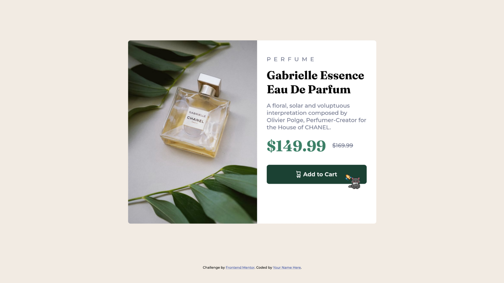

# Frontend Mentor - Product preview card component solution

This is a solution to the [Product preview card component challenge on Frontend Mentor](https://www.frontendmentor.io/challenges/product-preview-card-component-GO7UmttRfa). Frontend Mentor challenges help you improve your coding skills by building realistic projects. 

## Table of contents

- [Overview](#overview)
  - [The challenge](#the-challenge)
  - [Screenshot](#screenshot)
  - [Links](#links)
- [My process](#my-process)
  - [Built with](#built-with)
  - [What I learned](#what-i-learned)
- [Author](#author)

## Overview

### The challenge

Users should be able to:

- View the optimal layout depending on their device's screen size
- See hover and focus states for interactive elements

### Screenshot

### Links

- Solution URL: [Front End Mentor](https://www.frontendmentor.io/solutions/responsive-product-card-component-with-css-and-html-nyD51wBjQp)
- Live Site URL: [Product Preview Card](https://matiasmonzonrubano1-beep.github.io/Product-Preview-Card/#)

## My process

### Built with

- Semantic HTML5 markup
- CSS custom properties
- Flexbox
- CSS Grid
- Mobile-first workflow

### What I learned

I learned how to make a responsive design using html and css.

## Author

- Frontend Mentor - [@yourusername](https://www.frontendmentor.io/profile/matiasmonzonrubano1-beep)
